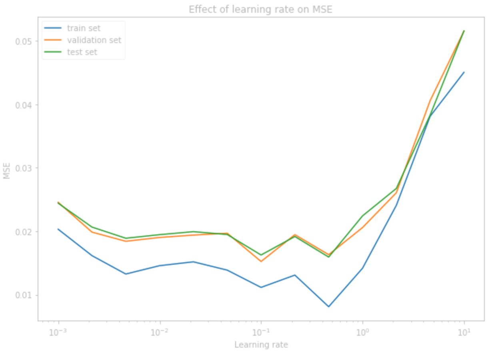
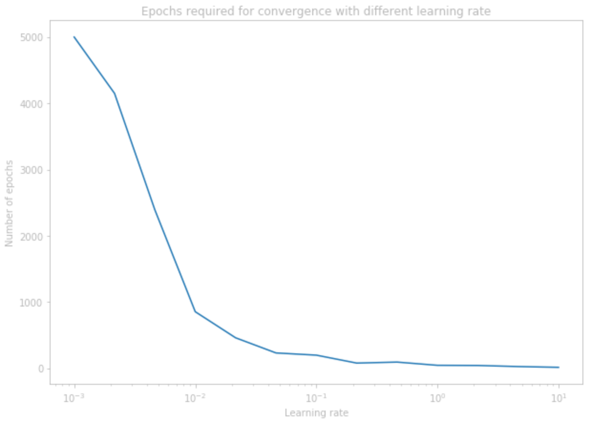
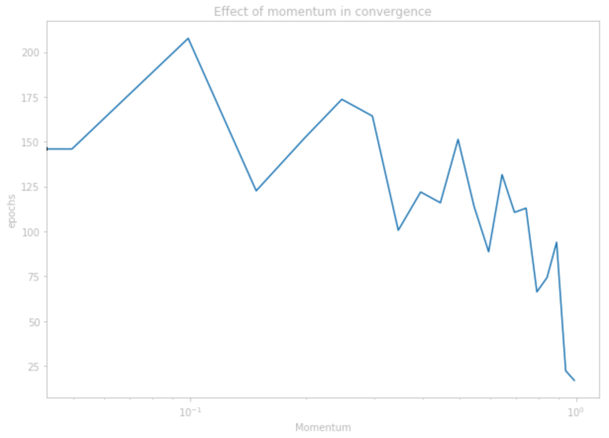

# Backpropagation for Multi-layer Perceptron

The Multi-layer Perceptron (MLP) model, with only a slight modification from the vanilla Perceptron model, is one of the most powerful machine learning models to date. The model solves a fundamental problem of the Perceptron model by incorporating an activation function, which is a non-linear function that acts on the matrix-vector multiplication output. With the activation function, the model can have multiple layers without them collapsing into an equivalent single layer. This simple change allows the model to learn not only linearly separable data, but non-separable ones as well. For this reason, they are commonly referred to as _universal function approximators_. 

The backpropagation algorithm which is a simple way to calculate the derivatives with the respect to the weights using chain rule allows the MLP to quickly and stably learn from data. The structure of MLP is identical to the feed-forward layers of modern Deep Neural Network that is the state-of-the-art today. In this project, we will discuss the implementation of the MLP model and the backpropagation algorithm, as well as the results of the experiments from the specifications.

## Code Implementation

### Forward Propagation

For the classification problem, let $D=\{(x_i,y_i)\}_{i=1}^{n}$ be a labeled dataset where $x_i \in \mathbb{R}^f$ is the input, where $f$ represents the number of features in each data point and $y_i \in \mathbb{R}^c$ is the one-hot encoding of the target, where $c$ is the number of classes of the labels. For each $x_i$, the model produces $\hat{y_i} = MLP(x_i)$ which is a prediction or an estimation of $y_i$. The forward propagation algorithm can be defined recursively as below:

```math
\begin{align}
  z_1 &= W_1 x + b_1\\
  a_1 &= \sigma(z_1)\\
  z_l &= W_l a_{l-1} + b_l\\
  a_l &= \sigma(z_l)\\
  a_L &= \hat{y}
\end{align}
```

We will let $`W = \{W_i\}_{i=1}^n, b = \{b_i\}_{i=1}^n`$ be the trainable weights and biases of the model. In practice, $\sigma$ can represent any kind of non-linear function, but for the purpose of this project, it will always be the _Sigmoid_ (logistic) function defined as $`\sigma(x) = {\Large\frac{1}{1 + e^{-x}}}`$. 

### Cost

The _cost_ (or loss) is then calculated as a function of $\hat{y}$ and $y$. For this project, the cost will always be the squared error $C(\hat{y}, y) = \frac{1}{2} (y - \hat{y})^2$. The goal of the MLP is then to minimize the cost by changing the weights and biases of the model. 

### Backward Propagation

In order to minimize the cost, we use calculus which allows us to find minimums and maximums of functions. The vector gradient of any function gives us the partial derivatives as its elements corresponding to its elementary bases. If we think about the cost function as a surface in a high dimensional vector space, the gradient gives us a direction and a magnitude of the most "upward" direction and the "steepness" of that direction from our current state, which corresponds to our current weights. By taking a small step in the exact opposite direction, we can eventually get to the "valley" of the surface, which would correspond to a minimum of the cost. This process is called _gradient descent_. 

Although finding the gradient can sound painful and computationally demanding, it is made simple through the use of chain rule and computing the gradient of weights at each layer backwards. This is why it's referred to as backward propagation (or backprop for short), because while computing for $\hat{y}$ requires us to pass the input layer by layer forward through the model, computing for the gradient requires us to pass the gradient of the cost layer by layer backwards through the same model. The gradient can be computed recursively as below:

```math
\begin{align}
  \delta_L &= \frac{\partial C}{\partial z_L} = \nabla C \odot \sigma'(z_L)\\
  \delta_l &= \frac{\partial C}{\partial z_l} = (W_{l+1}^T \delta_{l+1}) \odot \sigma'(z_l)\\
  \frac{\partial C}{\partial b_l} &= \delta_l\\
  \frac{\partial C}{\partial W_l} &= \delta_l a_{l-1}^T
\end{align}
```

The $\odot$ operation used in calculating the $\delta$ values is the _Hadamard product_, which is an element-wise multiplication between vectors. Once the gradients are all computed, we are ready to update the weights and biases by taking a small step down the gradient surface of the cost function. We will let $\eta$ be that small step-size, or _learning rate_ of the model. From here on, we will refer to both weights and biases as just weights, so $W_l$ includes $b_l$.

$$W_l \leftarrow W_l - \eta \frac{\partial C}{\partial W_l}$$

This algorithm can be sped up by incorporating a _momentum_ term. Going back to the analogy of descending down a surface, if we were to roll a ball down a mountain, it wouldn't necessarily always go down in the steepest direction at every moment. Instead, the momentum of the ball would cause it to tend towards the direction it was going before. Momentum in gradient descent is a similar idea---by incorporating the previous gradient terms, the model will reach convergence much faster. Let $0 \leq m < 1$ be our momentum and let $p_l$ be initialized as $0$ for each $l$. The new update equation is defined as:

```math
\begin{align}
    p_l &\leftarrow m p_l + \eta \frac{\partial C}{\partial W_l}\\
    W_l &\leftarrow W_l - p_l
\end{align}
```

### Stopping Criteria

In order to incorporate a stopping criterion for the MLP model, we split our training data into a training and validation data. After each epoch of training on the training set, we can look at the average MSE loss for our validation set. We would stop the training when the validation loss has not seen any improvement in a window of epochs. In my implementation, I set this window as 10, so if over 10 epochs the validation loss hasn't improved from, the training will come to a stop. Like before, I also added a value for maximum number of iterations, so that even if the stopping criterion is not met, the model will stop training if it has gone over the set limit.

### Weight Initialization

The MLP implementation allows for an arbitrary number of hidden layer with arbitrary number of nodes in each layer. Once we know the number of layers and nodes of the network and the dimensions of the input and output, the weights can be initialized. Unless otherwise given, the weights are initialized by sampling from a standard normal distribution (normal distribution with mean 0 and variance 1).

### Debug and Evaluation Datasets

The functionality of the model was first tested on the debug dataset. The final weights of the deterministic training of the debug dataset matches with the weights provided. The model was then trained on the evaluation dataset deterministically using the given hyperparameters.

## Iris Dataset

The Iris Dataset consists of 50 samples from each of three species of Iris (Iris Setosa, Iris virginica,and Iris versicolor).  Four features were measured from each sample: the length and the width of the sepals and petals, in centimeters.  The task is to predict the species using these four features. The model was trained using the hyperparameter given in the specifications. The dataset was split into training set and validation set, and the following graph shows the improvement in the train set loss, validation set loss, and validation set accuracy. 

<div align="center">

  
</div>

## Vowel Dataset

The vowel dataset is a labeled set with 3 categorical features, 10 continuous features, and 10 output classes. It is a dataset that consists of different people speaking each of the 10 vowel sounds and the task is to predict which vowel is said using the features as the input. Training on the data is more difficult than training on the Iris data since this data has more complicated structure. The Iris data is almost a linearly separable data, since we've shown in the last lab that a simple Perceptron classifier can predict with over 95\% accuracy. On the other hand, the vowel dataset is composed of higher dimensional features and more output classes that is not linearly separable. The baseline model was trained using 22 hidden nodes, learning rate of 0.1, and a momentum term of 0 and achieved an accuracy of 78.23\%.

The three categorical features were train/test, speaker identity, and their gender. Of these three categorical features, I only decided to use the gender feature. First, the train/test feature was not useful since it doesn't add any information about the vowel, and the two sets were split without being shuffled, so it wouldn't be wise to split the training and test set using this feature either. The speaker identification could prove to be a useful feature in a more powerful model, but for this task, it would require us to add an additional 15 features for the input, since there are 15 speakers in total. This would increase the size of the model by more than twice, which is not a worthwhile trade-off considering the little information it would provide. I chose to include the gender feature, however, since that only requires 1 additional feature, and might be the most important factor of speaker identity. 

### Learning Rate Experiment

In this experiment, we attempt to find the best learning rate for this task by training the model on different learning rates and comparing the loss on the validation set. To do this, I evenly divided the values from $0.001$ to $10$ into 13 values in a logarithmic scale and let each of those value be the learning rate of an experiment. Then for each learning rate, I trained 3 models where the weights were all randomly initialized and the data was shuffled after each epoch at random. I then retrieved the loss for the training set, validation set, and the test set and averaged these values for the 3 models trained. The number of epochs required for training was also averaged. The results were graphed and can be seen below.

<div align="center">

   
</div>

As can be seen above, The MSE slowly improves as the learning rate gets higher until near 0.1, then the MSE wildly increases. The best MSE for the validation set was achieved at exactly 0.1, which was the learning rate used for the other experiments. On the other hand, the number of epochs required for training when the learning rate is near 0.001 is so atrociously high, and it quickly drops as the learning rate increases. It seems that the model struggles to find the minimum when the learning rate is too high, which makes sense since taking too large of a step may lead to stepping over some of the minimums. 

### Optimal Number of Hidden Nodes

Similar to the learning rate experiment, we attempt to find the optimal number of nodes in the hidden layer by experimenting on different number of nodes and averaging the results between three independent experiment for each number. We first let the number of nodes be 1 and then double the number until there is no improvement on the validation set MSE. The result of this experiment is graphed below. 

<div align="center">

  
</div>

From this experiment, we found that the optimal number of hidden nodes is 32 based on validation set MSE.

### Momentum Experiment

Using the optimal values for the learning rate and number of hidden nodes found in the experiments above, we attempt to experiment on how much the momentum affects the speed of convergence. We do this by following a similar procedure as above: we evenly divided values between 0 and 0.99 (linear scale) into 21 values and let this value be the momentum. For each of these momentum values, we conduct 3 independent experiment and observe the number of epochs taken for each. We then average these numbers and graph them as shown below.

<div align="center">
  
  
</div>

We can see from the graph that in general, higher momentum speeds up convergence, although there are jagged pattern likely as a result of low number of experiments to get a reliable average. However, when the momentum was too high (< 0.9) there was a significant drop in the performance of the model, where the accuracy of the validation set dropped from a 75\% average to below 20\%. 

## Scikit-learn's MLP model

Using the Scikit-learn's MLP model, we experiment with the Iris dataset and the vowel dataset. It seems that the hyperparameters aren't of too importance in learning the Iris dataset, since no matter what (reasonable) hyperparameters I choose, the model always achieves a 100\% accuracy on the test set. One big thing we can notice is that when using the sigmoid activation, the model degenerates with too many layers. This is because of the "vanishing gradient" problem of the sigmoid function which won't be discussed further in this report. 

On the vowels dataset, when the hyperparameters are chosen identical to the ones we used, it seems that the performance of the model is very similar. Using the ReLU activation and increasing the depth of the model quickly allows it to reach very good accuracy. Using hidden layer widths of \[16, 32, 64, 32, 16\], incorporating early stopping for 100 iterations window, and using learning rate of 0.01, Nesterov momentum of 0.9, and alpha regularization term of 0.2, I was able to achieve 92.34\% on the test set created. 

For the final task, I attempted to train the model on the hand-written digit data available from Scikit-learn. We use a grid-search method to find the best learning rate and alpha regularization term. For the learning rate, we divide between 0.001 and 1 logarithmically and similarly for the alpha value. For the hidden layers, we use \[64, 128, 256, 128, 64\] found experimentally and use ReLU as the activation function. The best accuracy was achieved with 98.0\% accuracy with learning rate of 0.00428 and alpha value of 0.00681. 
